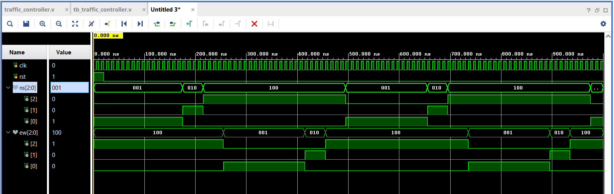
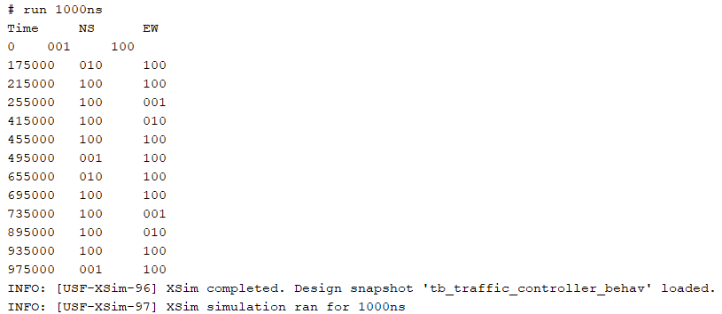

# Traffic-Light-Controller-Verilog

## Overview

This project implements a **Traffic Light Controller** using **Verilog HDL**.
The controller manages traffic signals at an intersection using a **Finite State Machine (FSM)** design.

The system controls **North-South (NS)** and **East-West (EW)** traffic signals and transitions between **Red, Yellow, and Green states** based on clock timing. The design is simulated using **Xilinx Vivado**.

---

## Features

* FSM-based traffic signal controller
* Six-state traffic light sequence
* Separate signal control for **North-South and East-West directions**
* Automatic signal timing control using counters
* Verilog testbench for simulation verification

---

## Tools Used

* **Verilog HDL**
* **Xilinx Vivado Design Suite**

---

## Project Files

* `traffic_light_controller.v` – Main traffic light controller design module
* `traffic_light_controller_tb.v` – Testbench for simulation
* `traffic_light_controller_waveform.png` – Simulation waveform output
* `traffic_light_controller_tcl_console.png` – TCL console simulation output
* `README.md` – Project documentation

---

## Simulation Waveform

The simulation waveform generated in **Xilinx Vivado** shows the state transitions of the traffic light controller. It verifies the correct switching between **Red, Yellow, and Green signals** for both North-South and East-West directions.

---

## TCL Console Output

The TCL console output displays monitored values of **North-South (NS)** and **East-West (EW)** traffic signals during simulation. This confirms correct FSM state transitions and signal timing.

---

## Applications

* Traffic intersection control systems
* Smart traffic management systems
* FPGA-based control systems
* Digital logic and FSM design demonstrations

---

## Author

**Manoj Kumar Naik Mudu**
